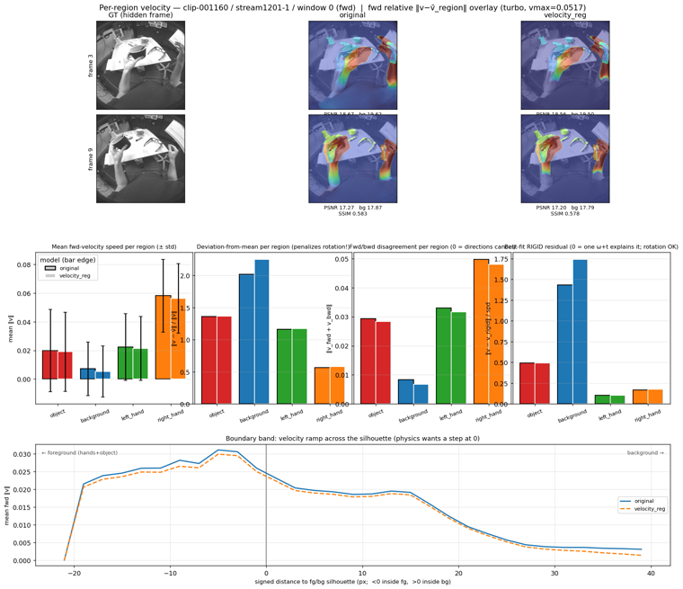
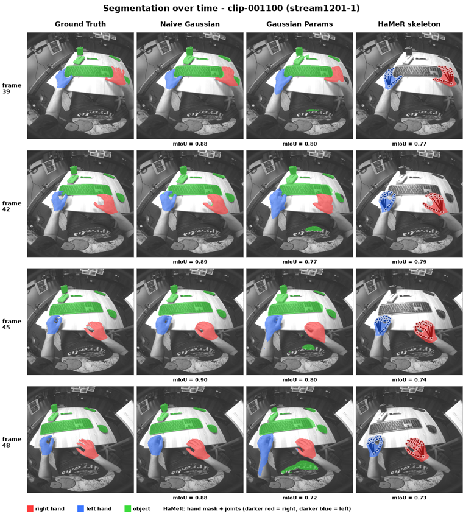

# Hands on Neoverse

This repository contains a modified fork of [NeoVerse](https://github.com/IamCreateAI/NeoVerse).

Forked from upstream commit
[`7595f14f`](https://github.com/IamCreateAI/NeoVerse/commit/7595f14f022599c3d2bec54c470c5eab80fe9c6a)
(`Add --low_vram mode to reduce peak GPU memory usage`, 2026-02-26), the last
upstream commit before our changes. The unmodified upstream reconstructor lives
under [`NeoVerse/`](NeoVerse/); our additions (HOT3D data pipeline, training,
benchmarks, demos) sit in the top-level folders described below.

## Repository layout

- **`demos/`** — visual, qualitative tools that render a model's output for a single clip so you can *see* what it does (segmentation overlays, side-by-side reconstructions, velocity-interpolation comparisons).
- **`evals/`** — quantitative benchmarks that score a model over a validation split (PSNR/SSIM/LPIPS for rendering, mIoU/IoU/accuracy/boundary-F1 for segmentation).
- **`hot3d/`** — the HOT3D data pipeline: download clips, extract images, render MANO hand/object masks, and pack everything into the per-clip NPZ training files.
- **`training/`** — training entry points for the heads we added on top of the frozen reconstructor (hand segmentation, per-Gaussian mask, velocity regularization).

### `demos/`

| Script | What it does | Run |
| --- | --- | --- |
| `eval_segmentation.py` | Scores the 2D `hand_pred_head` on one NPZ clip and writes an `input \| prediction \| ground-truth` video. | `sbatch demos/eval_seg_job.sh` |
| `eval_segmentation_gs_mask.py` | Same evaluation but for the per-Gaussian `gs_mask` head — scores the rasterized mask channels instead of the 2D head. | `python -m demos.eval_segmentation_gs_mask --npz diffsynth/data/training_data/clip-001053.npz --gs_mask_head_path models/NeoVerse/gs_mask_model_run20260510-175056_epoch006.ckpt` |
| `reconstruction_demo.py` | Reconstruction-only Gradio app (~1–2 GB VRAM, no diffusion model). | `python -m demos.reconstruction_demo --low_vram` |
| `reconstruction_compare_demo.py` | Renders one window with one or two reconstructors next to the ground truth, annotated with per-frame PSNR/SSIM. | `python -m demos.reconstruction_compare_demo` |
| `interpolation_compare_demo.py` | Hides the odd frames of a window and compares how each model reconstructs them via the velocity field. | `python -m demos.interpolation_compare_demo` |
| `interpolation_velocity_regions_demo.py` | Variant that splits the predicted velocity field into the four segmentation regions and characterises each one separately. | `python -m demos.interpolation_velocity_regions_demo` |

Examples (reduced from [`outputs/`](outputs/); full-res artifacts live there):

Segmentation eval (`gs_mask`), `input | prediction | ground truth`:


Reconstruction comparison:


Keyframe interpolation comparison:


Per-region velocity interpolation:



### `evals/`

| Script | What it does | Run |
| --- | --- | --- |
| `benchmark_rec.py` | Current reconstruction + segmentation benchmark; supports `--mode reconstruction` and `--mode seg_compare` (hand_seg vs gs_mask). | `sbatch evals/benchmark_rec.sh` (reconstruction) or `sbatch evals/benchmark_seg_compare.sh` (head comparison) |
| `benchmark.py` | Older single-model reconstruction + segmentation benchmark. | `sbatch evals/jobscript.sh` |
| `bechmark_interpolation.py` | Keyframe-interpolation rendering core (held-out in-between frames). Not run directly — imported by `benchmark_rec.py` and the interpolation demos. | _(library module)_ |

Example reconstruction grid (gt / raw / naive / gsparam / skeleton):



### `hot3d/`

| Script | What it does | Run |
| --- | --- | --- |
| `optimized_download.py` | Downloads and pre-processes HOT3D clips into per-clip `clip-XXXXXX.npz` files (images + hand/object masks). | `python -m hot3d.optimized_download` |
| `download_HOT3D.py` | Original (pre-optimisation) download + preprocess script. | `python -m hot3d.download_HOT3D` |
| `extract_images.py` | Extracts per-stream images from a clip tar. | `python -m hot3d.extract_images` |
| `make_masks.py` | Renders MANO hand/object segmentation masks for a clip. | `python -m hot3d.make_masks` |
| `extract_training_data.py` | Packs extracted images + masks into NPZ and writes ready-sentinels for the dataset to ingest. | `python -m hot3d.extract_training_data` |
| `SimpleExtractTrainingData.py` | Simplified single-process variant of the training-data extractor. | `python -m hot3d.SimpleExtractTrainingData` |
| `precompute_features.py` | Pre-extracts frozen-backbone features to disk so training can skip the backbone (~85% of step time). | `python -m hot3d.precompute_features --data_root diffsynth/data/training_data --output_dir diffsynth/data/training_features --model_path models/NeoVerse/reconstructor.ckpt` |
| `dataloader.py` | Minimal WebDataset sanity-check over a HOT3D shard. | `python -m hot3d.dataloader` |

<!-- No example output committed yet — drop a rendered-mask figure here when available. -->


### `training/`

| Script | What it does | Run |
| --- | --- | --- |
| `hand_pred.py` | Trains the 2D `hand_pred_head` segmentation head (backbone + other heads frozen). | `sbatch training/train_classificationHead.sh` |
| `gs_mask.py` | Trains per-Gaussian mask logits, rendered through the rasterizer and supervised against GT masks (only the `gs_head` trains). | `sbatch training/train_gs_mask.sh` |
| `velocity_regularization.py` | Regularizes background (class 3) Gaussians toward ~0 velocity while leaving hand/object velocity free, using the frozen model as a teacher. | `sbatch training/train_vel_reg.sh` |

Example velocity poster from the regularized model:


# How to

These scripts target the student cluster (SLURM) with a CUDA 12.8 toolchain.
Create and populate the `neoverse` virtualenv once, then submit the job scripts.

```bash
# 1. Load the matching CUDA module (every job script runs `module add cuda/12.8`)
. /etc/profile.d/modules.sh
module add cuda/12.8

# 2. Create and activate the venv (named `neoverse`, expected by every script)
python3.10 -m venv neoverse
source ./neoverse/bin/activate

# 3. Install dependencies + download the base reconstructor checkpoint
bash NeoVerse/setup.sh
```

After that, run any task by submitting its SLURM script, e.g.
`sbatch training/train_vel_reg.sh`. Each script re-loads `cuda/12.8` and
`source ./neoverse/bin/activate`, so the venv and CUDA module must exist and
match. To run a script interactively instead, activate the venv and invoke the
Python module directly (see the **Run** columns above).

# Docs

- [Benchmark implementation details](docs/BENCHMARKS.md) — how the reconstruction/segmentation and keyframe-interpolation suites compute their numbers.
- [Velocity-regularization experiment log](docs/VELOCITY_REGULARIZATION_LOG.md) — setup, frozen modules, loss terms, and the log of experiments run on vel-reg.

# Dependencies

Installed by [`NeoVerse/setup.sh`](NeoVerse/setup.sh) on top of Python 3.10 and
the `cuda/12.8` module:

| Package | Version | Source |
| --- | --- | --- |
| torch | 2.7.1 (cu128) | `download.pytorch.org/whl/cu128` |
| torchvision | 0.22.1 (cu128) | `download.pytorch.org/whl/cu128` |
| torch-scatter | matches torch-2.7.1+cu128 | `data.pyg.org` wheel |
| gsplat | git `main` | nerfstudio-project/gsplat |
| hand_tracking_toolkit | git `main` | facebookresearch |
| chumpy | git `main` | mattloper/chumpy |
| smplx | git `main` | vchoutas/smplx |

Pinned in [`NeoVerse/requirements.txt`](NeoVerse/requirements.txt):

| Package | Version |
| --- | --- |
| transformers | 4.57.6 |
| moviepy | 1.0.3 |
| deepspeed | 0.16.7 |
| safetensors, einops, numpy, Pillow, tqdm, sentencepiece | unpinned |
| imageio, imageio[ffmpeg], opencv-python, decord | unpinned |
| huggingface_hub, modelscope | unpinned |
| jaxtyping, scipy, matplotlib, evo, e3nn, addict | unpinned |
| gradio, trimesh | unpinned |
| accelerate, omegaconf, peft, tensorboard | unpinned |
| ftfy, pandas | unpinned |

Additional imports used by the `hot3d/` and `evals/` code that are **not** in
`requirements.txt` and must be installed separately:

| Package | Used by | Notes |
| --- | --- | --- |
| webdataset | `hot3d/dataloader.py`, download scripts | WebDataset streaming of HOT3D shards |
| torchmetrics | `evals/benchmark*.py` | PSNR / SSIM / LPIPS metrics |
</content>
